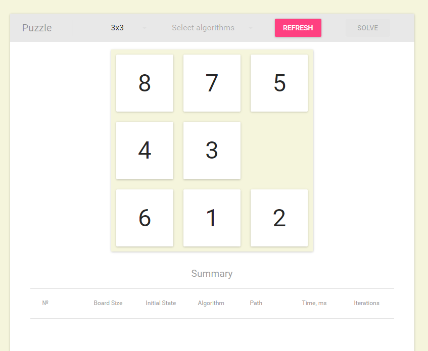
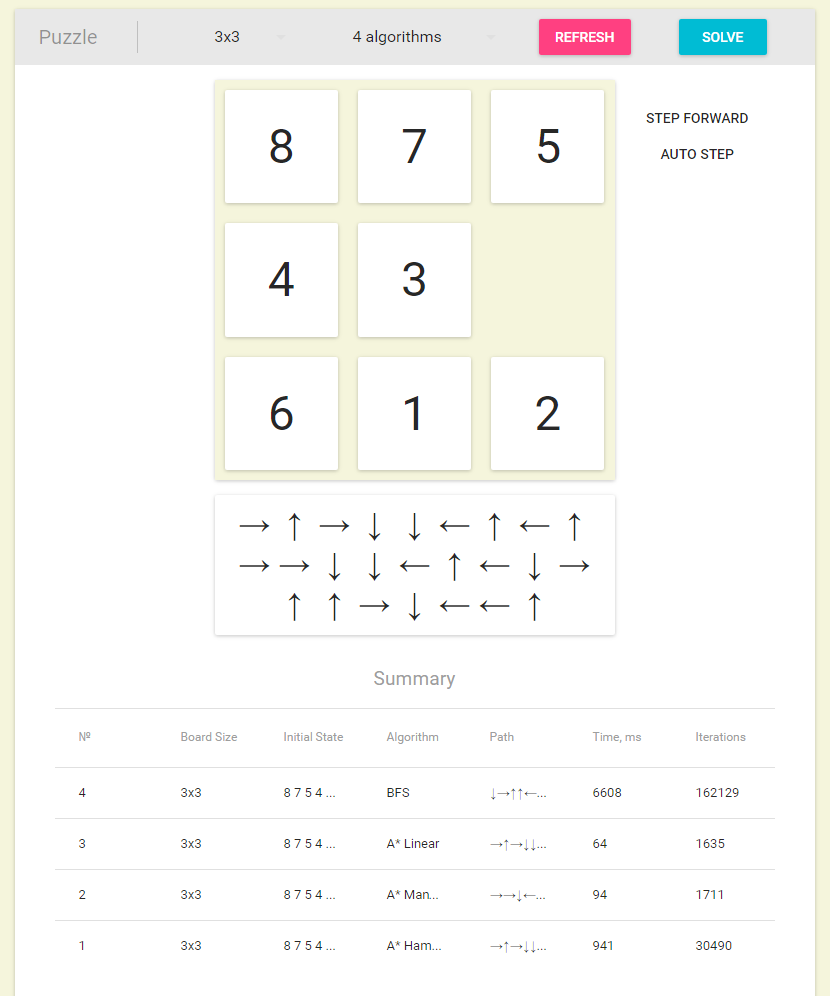
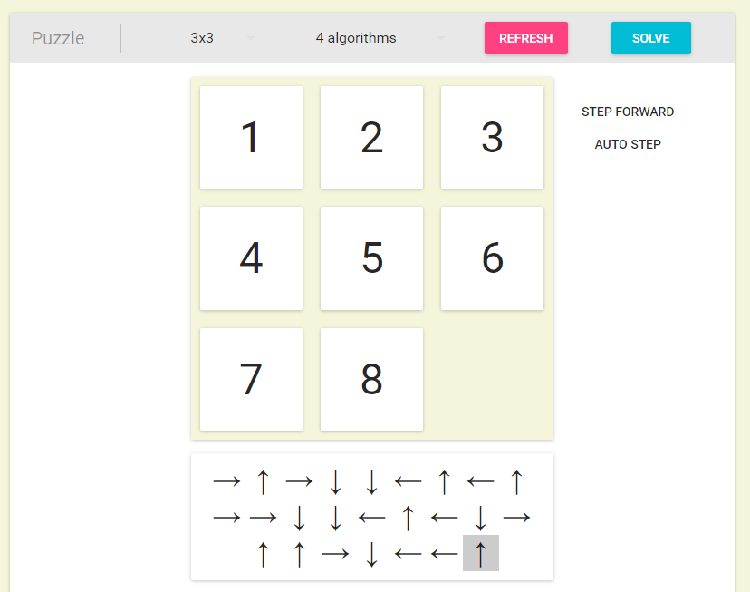
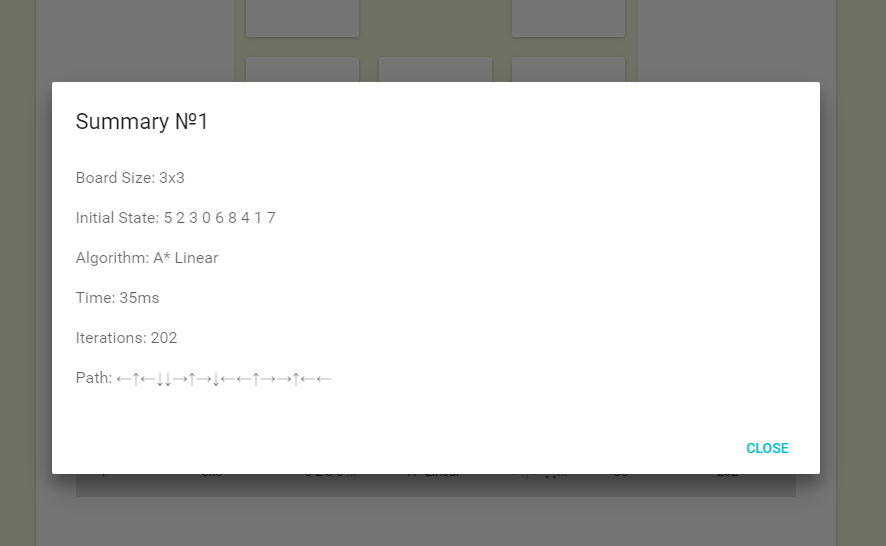

# Puzzle problem

### Search algorithms implementation for puzzle problem solving

## List of implemented algotihms

Non-informative algorithms:
- BFS

Informative algorithms:
- A*

Heuristics for informative algorithms:
- Hamming distance
- Manhattan distance
- Manhattan distance with linear conflicts

Program is written with React using basic [create-react-app](https://github.com/facebookincubator/create-react-app) boilerplate.
create-react-app is unpacked in order to add Web Worker support for Webpack. We need Web Workers because algorithms run in parallel and user can interact with first solution when others are still computing.

## Screenshots
Initial state

Pathes found

Puzzle solved

Summary row clicked

